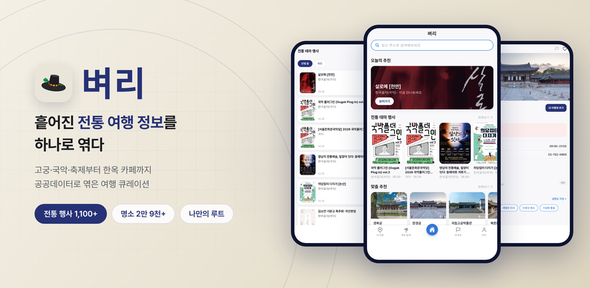
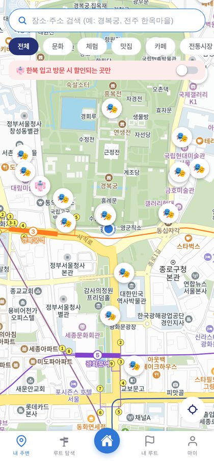
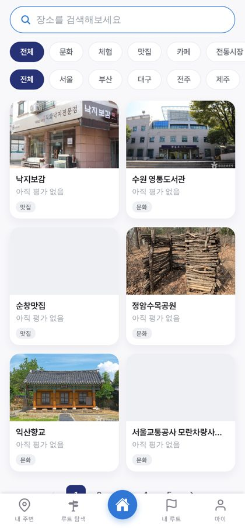
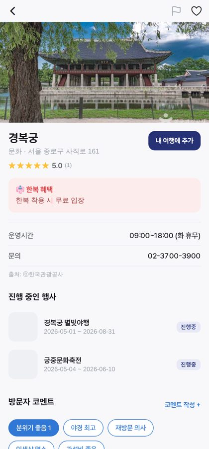
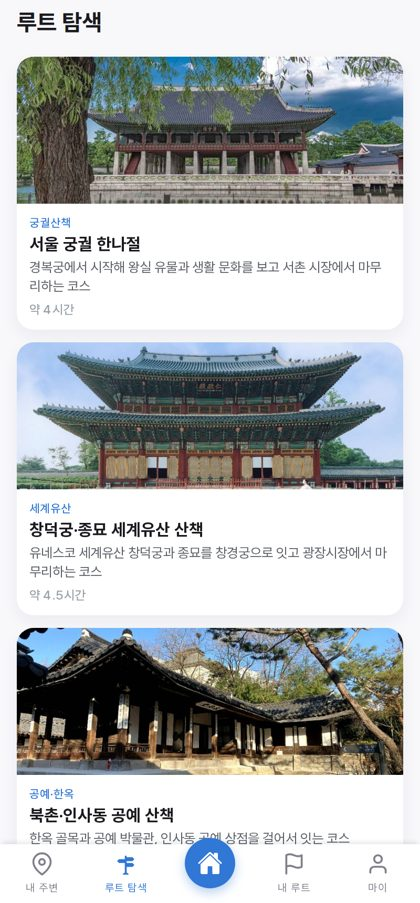
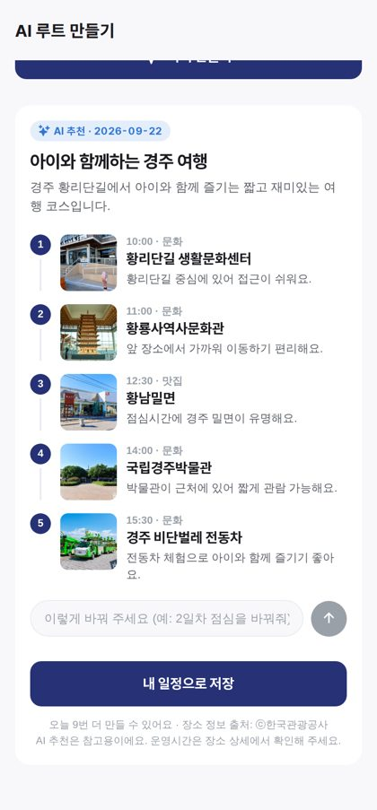
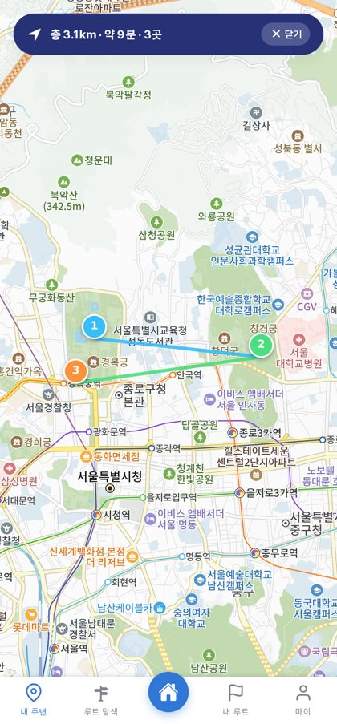

# 벼리 · Byeori

<p align="center">
  
</p>

<p align="center">
  <b>전국의 관광 명소와 전통 공연·축제를 한 지도에서 찾고, AI와 함께 여행 코스를 짜는 서비스</b><br>
  <a href="https://byeori.ernebi.org">byeori.ernebi.org</a> · 2026 관광데이터 활용 공모전 웹·앱 개발 부문
</p>

---

'벼리'는 그물의 코를 꿴 굵은 줄을 뜻하는 순우리말입니다. 전통 공연·축제 정보와 관광 명소 정보는 서로 다른 기관이 따로 제공해 흩어져 있습니다. 국악 공연을 보러 가면서 근처 고궁이나 한옥 카페를 함께 둘러보려 해도 여러 사이트를 오가야 합니다. 벼리는 한국관광공사 OpenAPI의 장소 정보와 공연·축제 정보를 **하나의 지도 위에 엮어**, 전통문화를 '보러 가는 일'이 아니라 '여행하는 일'로 만듭니다.

현재 **장소 33,900여 곳**, **공연·축제 10,600여 건**(전통 테마 1,400여 건), **추천 코스 14개**를 담고 있습니다.

---

## 화면

| 홈 | 지도 탐색 | 검색·지역 탐색 |
|:--:|:--:|:--:|
|  |  |  |
| 오늘의 추천과 전통 테마 행사 | 주변 장소를 지도에 표시, 축소하면 묶어서 개수로 | 문화·체험·맛집·카페·전통시장·공예·한옥스테이 |

| 장소 상세 | 루트 탐색 | AI 코스 | 이동 경로 |
|:--:|:--:|:--:|:--:|
|  |  |  |  |
| 한복 혜택·운영 정보·진행 중인 행사 | 전국 12개 권역, 코스 14개 | 조건을 고르면 AI가 코스를 짬 | 총 거리·소요 시간과 경로 |

---

## 이 서비스가 하는 일

**전통 테마 행사를 가려냅니다.** 공공데이터는 전통 행사를 따로 구분해 주지 않습니다. 장르 코드만으로는 놓치는 행사가 많아, 제목과 주최기관을 함께 검사하는 규칙으로 국악·전통무용·마당극·전통축제를 골라냅니다.

**전통문화에 맞는 분류를 만듭니다.** 공사 유형 코드로는 카페와 맛집이 한 덩어리(39)이고, 쇼핑·숙박은 대부분 전통문화와 무관합니다. 신분류체계를 파고들어 전통시장(SH06)·공예(SH050100)·한옥스테이(AC030200)만 골라 별도 분류로 제공합니다.

**목록은 빠르게, 상세는 최신으로.** 명칭·주소·좌표·분류는 거의 변하지 않아 저장된 값으로 즉시 보여 주고, 이용시간·휴무일·문의처처럼 자주 바뀌는 정보는 상세를 열 때 공사 API로 실시간 조회합니다. 공사가 내린 콘텐츠는 `showflag`로 확인해 즉시 비노출 처리합니다. (로컬 저장은 한국관광공사 승인을 받았습니다.)

**AI가 장소를 지어내지 않습니다.** 지역·테마·날짜와 "아이와 함께" 같은 요청을 받아 최대 3일 코스를 만드는데, AI에게 장소를 만들게 하지 않습니다.

```
1. 서버가 DB에서 후보를 뽑는다      그 날 지역 반경 2km, 테마별로 나눠서
2. 서버가 하루 틀을 정한다          오전 관람 → 점심 → 카페 → 오후 관람 → 숙소
3. AI는 칸마다 한 곳씩 고른다       후보 목록 안에서만
4. 서버가 응답을 대조한다           없는 ID·중복·분류 불일치는 그 칸을 비운다
```

이름·사진·좌표·시각은 모두 우리 DB와 틀의 값입니다. "점심을 바꿔 주세요"처럼 말해 다듬을 수도 있고, 그때는 **바꿀 칸만** AI가 답하고 나머지는 서버가 그대로 둡니다.

---

## 기술

| 구분 | 선택 |
|---|---|
| 백엔드 | Spring Boot 4 · Java 17 · JPA · Flyway |
| 데이터베이스 | PostgreSQL 16 |
| 앱·웹 | React Native (Expo SDK 54) + expo-router — 같은 코드로 앱과 웹 배포 |
| 상태 | TanStack Query + zustand |
| 지도·길찾기 | 카카오맵 · 카카오모빌리티 |
| AI | OpenAI (structured outputs) |
| 인프라 | Docker Compose · nginx(443만 외부 노출) · 단일 VM |

### 저장소 구성

```
byeori/
├─ apps/
│  ├─ api/            Spring Boot — domain 별 패키지(venue·performance·itinerary·ai·sync…)
│  └─ app/            Expo 앱·웹 — src/app 라우트, src/lib 공통
├─ infra/             docker-compose · .env(gitignore)
├─ docs/              기술 문서 · 제출 서류 · 화면 캡처
└─ scripts/           인증키 점검·교체 등 운영 스크립트
```

설계 문서는 [`docs/byeori-tech-spec.md`](docs/byeori-tech-spec.md)(PDF 동봉), 데이터 모델은 [`erd_final_1.txt`](erd_final_1.txt)에 있습니다.

### 데이터 출처

| 데이터 | 제공 |
|---|---|
| 관광지·문화시설·음식점·쇼핑·숙박·축제 | 한국관광공사 국문 관광정보 서비스(KorService2) |
| 공연 정보 | 공연예술통합전산망(KOPIS) — (재)예술경영지원센터 |
| 문화행사 | 서울시 열린데이터광장 |
| 지도·길찾기·장소 검색 | 카카오 |

공사 데이터를 노출하는 화면에는 **출처: ⓒ한국관광공사**를 표기합니다.

---

## 실행

백엔드(PostgreSQL + API)는 `infra/docker-compose.yml` 하나로 뜹니다.

```bash
cd infra
docker compose up -d
docker compose logs -f api
```

> ⚠️ **`--remove-orphans` 를 쓰지 마세요.** 이 compose는 프로젝트명이 `infra`라, 같은 이름을 쓰는 다른 스택(nginx·certbot)과 공유됩니다. orphan 정리를 하면 그쪽 컨테이너가 지워집니다.

앱·웹은 Expo로 실행합니다.

```bash
cd apps/app
npm install
npx expo start            # 앱(QR) · 웹은 w 키
npx expo export --platform web   # 정적 웹 산출물 → dist/
```

### 환경변수

시크릿은 `infra/.env`(gitignore)에서 주입합니다. 저장소에 없으니 새 환경에서는 따로 받아야 합니다.

| 키 | 쓰임 |
|---|---|
| `TOURAPI_KEY` · `KOPIS_KEY` · `SEOUL_OPEN_API_KEY` | 공공데이터 수집 |
| `JWT_SECRET` | JWT 서명(32바이트 이상, 없으면 기동 실패) |
| `KAKAO_REST_KEY` · `KAKAO_CLIENT_SECRET` · `GOOGLE_CLIENT_ID` | 지도·길찾기·장소 검색, 소셜 로그인 |
| `OPENAI_API_KEY` · `OPENAI_MODEL` | AI 코스(없으면 기능과 버튼이 꺼짐) |
| `AI_DAILY_LIMIT_PER_USER` · `AI_DAILY_LIMIT_TOTAL` | AI 하루 사용 상한(기본 10 / 300) |
| `ADMIN_ID` · `ADMIN_PASSWORD` · `REVIEW_ID` · `REVIEW_PASSWORD` | 관리자·심사용 계정 |

포트는 PostgreSQL `127.0.0.1:5432`, API `127.0.0.1:8080`으로 **호스트 로컬 전용**입니다. 외부에는 nginx(443)만 열려 있습니다.

### 점검

```bash
curl http://127.0.0.1:8080/actuator/health        # {"status":"UP"}
./scripts/check-tourapi-key.sh                    # 공사 인증키 상태
./scripts/set-tourapi-key.sh                      # 인증키 교체(검증 후 반영)
```

nginx 경유가 502면 API 컨테이너가 재생성되며 nginx가 옛 IP를 물고 있는 경우입니다. `docker exec seoulride-nginx nginx -s reload` 하세요.

---

## 테스트

```bash
cd apps/api && ./gradlew test     # 서버 단위 테스트
cd apps/app && npx tsc --noEmit   # 앱 타입 검사
```

## 기여 · 협업 규칙

브랜치·커밋·PR 규칙은 [`CONTRIBUTING.md`](CONTRIBUTING.md)에 있습니다. `main` 직접 push는 막혀 있고, 토픽 브랜치 + PR(1인 리뷰) + Squash 머지로 반영합니다.
